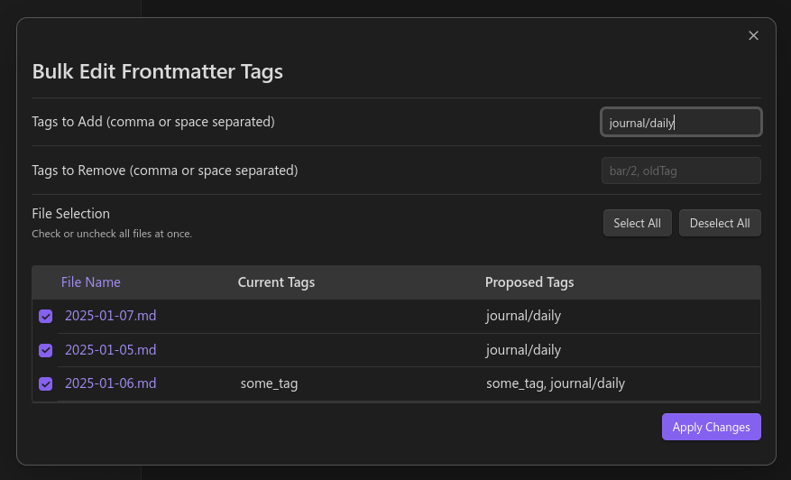
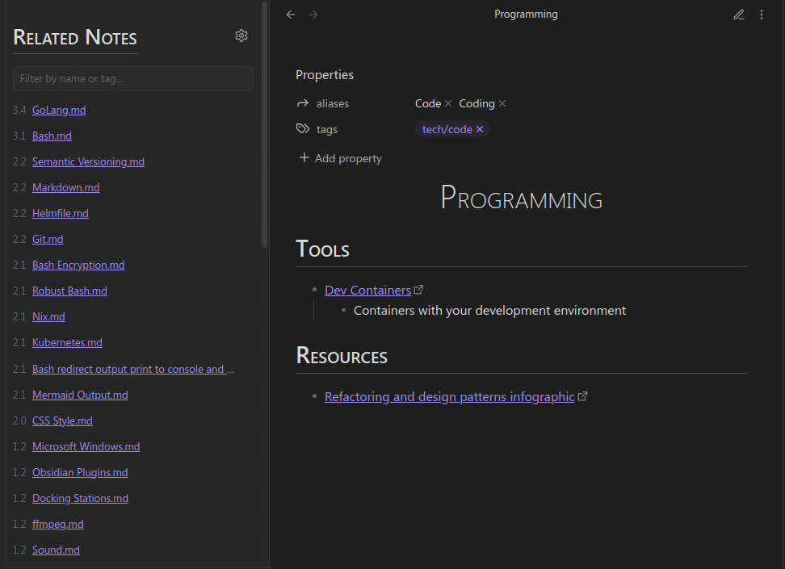
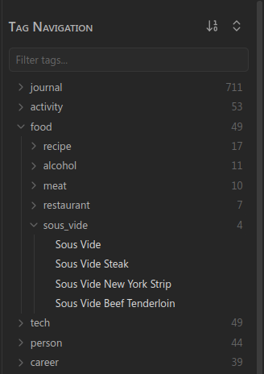

# Tag Tactician Obsidian Plugin

Tag Tactician is an Obsidian plugin that makes it easy to bulk edit the frontmatter tags of multiple notes at once. 
You can add or remove tags across many files, preview proposed changes, and selectively apply updates to individual 
notes—all without leaving Obsidian.

Additionally, Tag Tactician comes with a "Related Notes" View to display notes that have similarities to the current
active note.  Notes are determined to be related based on similarity of tags, filename, links, and more.

Tag Tactician also has a "Tag Navigation" view to display your notes in a hierarchy format organized by their tags.

## Installation (from obsidian)

1. Open Settings > Community Plugins.
2. Make sure “Safe Mode” is off.
3. Click “Browse” and search for `Tag Tactician`.
4. Click “Install”, then “Enable”.

## Bulk Tag Operations



1. **BACK UP YOUR VAULT**
   2. This plugin is still in early development and there is no undo feature!
1. Right-click on:
   1. A single note, 
   2. Multiple selected notes, or 
   3. A folder (to include all .md files within).
2. Choose “Edit tags (frontmatter)” from the menu.
3. A modal will appear, showing:
   1. Fields for “Tags to add” and “Tags to remove.”
      2. For multiple tags, separate them with commas.
   2. A table listing each file, its current tags, and a live preview of its proposed tags.
   3. Checkboxes to select/deselect which files should get updated.
   6. After verifying the changes, click "Apply changes" to update all checked files at once.

### Settings

- Show Warning for Non-Markdown Files: When enabled, files that aren’t .md are listed with a warning and are excluded from modification.
- Tag List Style: Choose between:

Hyphens (block style arrays)
```yaml
tags:
  - foo
  - bar 
```

Brackets (flow style arrays, e.g. tags: [foo, bar]).
```yaml
tags: [foo, bar]
```

### Caveats & Limitations

- Supports Frontmatter Tags Only: Inline #tags (in body text) are not changed.
- Invalid YAML: If a note has broken YAML or duplicate keys for tags, the plugin will skip that note and warn you. You must fix it manually.
- Large Vaults: Updating thousands of notes simultaneously could be slow; consider selecting a smaller scope (folder or partial selection) at a time.
- No Undo: Obsidian doesn’t have a built-in undo for plugin-driven bulk edits. **Back up your vault**, or test changes on sample notes if you’re unsure.

## Related Notes View



The Related Notes view helps to find notes in your vault that are potentially related to the current active note.  
How much one note is "related" to is determined by customizable weighting of tag similarity, title similarity, path 
similarity, path similarity, and linking to each other. 

To open the Related Notes view, open the command palette and search for "Tag Tactician: Open Related Notes Sidebar".

When a note is active, the Related Notes View will show a list of related notes.  Each item contains:

1. A link to the note.
2. (Optional) A "score" for how similar the note is to the active note (higher is more similar).
3. (Optional) A list of tags on the related note.

Above the related notes list is: 

1. A menu with options such as show/hide tags, show/hide score, and also a button to refresh the list.
2. A filtering text box to filter the list of related notes by title or tag.

### Settings

- **Show tags by default:** When enabled, the tags of related notes will be shown by default.
- **Show score by default:** When enabled, the score of related notes will be shown by default.
- **Hide results with score below:** Related notes with a score below the specified value will be hidden in the view. 
  - Default value is `1`.
- **Score weighting adjustments**: Adjust the weight of each factor in the similarity score calculation.
  - Higher values increase the importance of that factor.
  - Set the weight to `0` to ignore that factor.
  - Default value for each is `1`.

## Tag Navigation



The Tag Navigation view is a sidebar panel to navigate your notes organized by a hierarchical tag structure.  In this 
way, if a note has a nested tags, that tag effectively acts as a folder in the tag navigation view.  This approach is 
superior to folders because it allows for a note to be in multiple "folders" at once.

Above the tag list is:

1. A button to change the sort order of the tags (by name or note count).
2. A button to expand/collapse all tags.
3. A filtering text box to filter the list by title or tag.

### Settings

- **Default navigation sorting:** Choose between sorting tags by name or note count.