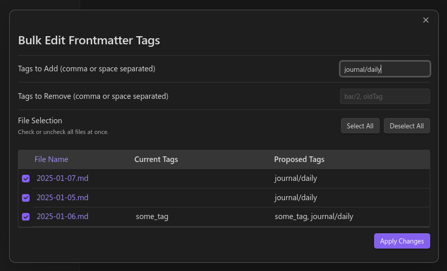

# Tag Tactician Obsidian Plugin

Tag Tactician is an Obsidian plugin that makes it easy to bulk edit the frontmatter tags of multiple notes at once. 
You can add or remove tags across many files, preview proposed changes, and selectively apply updates to individual 
notes—all without leaving Obsidian.



## Installation

From within Obsidian:

1. Open Settings > Community Plugins.
2. Make sure “Safe Mode” is off.
3. Click “Browse” and search for Tag Tactician.
4. Click “Install”, then “Enable”.

## Usage

1. **BACK UP YOUR VAULT**
   2. This plugin is still in early development and there is no undo feature!
1. Right-click on:
   1. A single note, 
   2. Multiple selected notes, or 
   3. A folder (to include all .md files within).
2. Choose “Edit Tags (Frontmatter)” from the menu.
3. A modal will appear, showing:
   1. Fields for “Tags to Add” and “Tags to Remove.” 
   2. A table listing each file, its current tags, and a live preview of its proposed tags.
   3. Checkboxes to select/deselect which files should get updated.
   4. Adjust your “add/remove” inputs. The Proposed Tags column updates instantly.
   5. Select All or Deselect All if needed.
   6. When satisfied, click Apply Changes to update all checked files at once.

## Settings

- Show Warning for Non-Markdown Files: When enabled, files that aren’t .md are listed with a warning and are excluded from modification.
- Tag List Style: Choose between:

Hyphens (block style arrays)
```yaml
tags:
  - foo
  - bar 
```

Brackets (flow style arrays, e.g. tags: [foo, bar]).
```yaml
tags: [foo, bar]
```

You can find these settings under Settings > Tag Tactician

## Caveats & Limitations

- Supports Frontmatter Tags Only: Inline #tags (in body text) are not changed.
- Invalid YAML: If a note has broken YAML or duplicate keys for tags, the plugin will skip that note and warn you. You must fix it manually.
- Large Vaults: Updating thousands of notes simultaneously could be slow; consider selecting a smaller scope (folder or partial selection) at a time.
- No Undo: Obsidian doesn’t have a built-in undo for plugin-driven bulk edits. **Back up your vault**, or test changes on sample notes if you’re unsure.