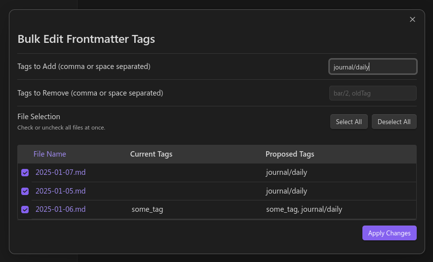
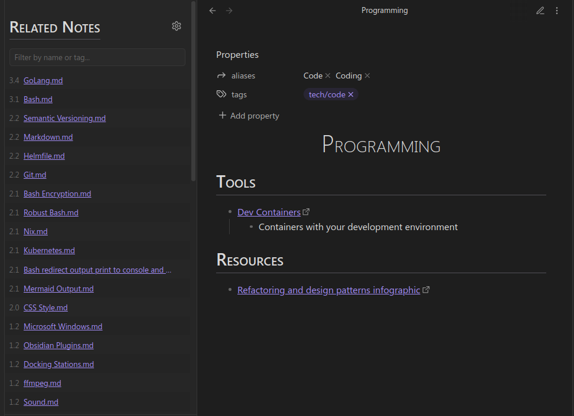
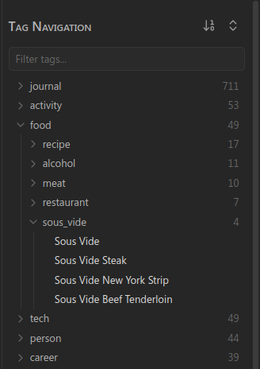

# Tag Tactician

Better tag management for [Obsidian](https://obsidian.md): bulk-edit frontmatter tags, discover related notes through tag similarity, and browse your vault by a hierarchical tag structure.

## Features

- **Bulk tag operations** — add or remove frontmatter tags across many notes (or whole folders) at once, with a live preview before you apply.
- **Related notes** — a sidebar that surfaces notes similar to the one you're viewing, scored by tag overlap, title, path, and links.
- **Tag navigation** — a sidebar that organizes your notes into a collapsible hierarchy based on nested tags, so one note can live in many "folders" at once.

## Contents

- [Requirements](#requirements)
- [Installation](#installation)
- [Bulk tag operations](#bulk-tag-operations)
- [Related notes view](#related-notes-view)
- [Tag navigation view](#tag-navigation-view)
- [Commands](#commands)
- [Support & contributing](#support--contributing)

## Requirements

Tag Tactician requires Obsidian **1.7.2** or newer.

## Installation

1. Open **Settings → Community plugins**.
2. Turn off **Restricted mode** (formerly "Safe mode").
3. Click **Browse** and search for `Tag Tactician`.
4. Click **Install**, then **Enable**.

## Bulk tag operations



Add or remove frontmatter tags across many notes in one pass.

> ⚠️ **Back up your vault first.** This plugin is still in early development and there is **no undo** for bulk edits.

### How to use

1. Open the bulk-edit modal in one of these ways:
   - Right-click one or more notes **or folders** and choose **Edit tags (frontmatter)**. (Folders are expanded to all the notes inside them.)
   - In the **Search** results pane, click the results menu (the icon above the results) and choose **Edit tags on N notes…**.
2. In the modal you'll see:
   - **Add tags** and **Remove tags** fields — enter one or more tags, separated by commas.
   - A table of every selected file showing its current tags and a live preview of the proposed result.
   - A checkbox per row to include or exclude that file (use **Select all** / **Deselect all** to toggle them together).
3. Review the preview, then click **Apply changes** to update every checked file at once.

### Settings

- **Show warning for non-Markdown files** — when enabled, non-`.md` files in your selection are listed with a warning and excluded from changes.
- **Tag list style** — how tag arrays are written to frontmatter:

  Hyphens (block style):
  ```yaml
  tags:
    - foo
    - bar
  ```

  Brackets (flow style):
  ```yaml
  tags: [foo, bar]
  ```

### Caveats & limitations

- **Frontmatter tags only** — inline `#tags` in the note body are not modified.
- **Invalid YAML** — notes with broken YAML or duplicate `tags` keys are skipped with a warning; fix those manually.
- **Large vaults** — updating thousands of notes at once can be slow; consider working in smaller batches (a folder or partial selection at a time).
- **No undo** — Obsidian has no built-in undo for plugin-driven edits, so back up your vault or test on a few sample notes first.

## Related notes view



Finds notes that are similar to the note you're currently viewing. Similarity is a weighted blend of **tag similarity**, **title similarity**, **path similarity**, and whether the notes **link to each other**.

Open it from the command palette: **Tag Tactician: Open related notes sidebar**.

When a note is active, the view lists related notes. Each entry shows:

1. A link to the note.
2. *(Optional)* A similarity **score** — higher means more similar.
3. *(Optional)* The **tags** on that note.

The toolbar above the list provides:

- An options menu to show/hide tags, show/hide the score, and refresh the list.
- A filter box to narrow the list by title or tag (matches are highlighted).

### Settings

- **Show tags by default** — show related notes' tags when the view opens.
- **Show score by default** — show the similarity score when the view opens.
- **Hide results with score below** — hide related notes scoring under this threshold (default `1`).
- **Score weighting** — adjust how much each factor (tag, title, path, links) contributes to the score.
  - Higher values increase that factor's importance.
  - Set a weight to `0` to ignore that factor entirely.
  - Each defaults to `1`.

## Tag navigation view



A sidebar that organizes your notes into a collapsible hierarchy built from nested tags. A nested tag such as `programming/python` acts like a folder — but unlike folders, a note can appear under every tag it carries.

Open it from the command palette: **Tag Tactician: Open tag-based file navigation**.

The toolbar above the list provides:

- A button to change the sort order (by name, note count, or created/modified date).
- A button to expand or collapse all tag groups.
- A filter box to narrow the list by tag or filename (matches are highlighted).

### Settings

- **Default navigation sorting** — the sort order applied when the view opens.
- **Tag group icon (closed / open)** — the icons used for collapsed and expanded tag groups.
- **File icon** — the icon shown next to individual notes.

## Commands

| Command | What it does |
| --- | --- |
| **Open related notes sidebar** | Opens the Related notes view in the right sidebar. |
| **Open tag-based file navigation** | Opens the Tag navigation view in the left sidebar. |

Bulk tag editing is triggered from the file/folder right-click menu and the search results menu rather than a command (see [Bulk tag operations](#bulk-tag-operations)).

## Support & contributing

Found a bug or have a feature idea? Please open an issue on the [GitHub repository](https://github.com/scottTomaszewski/obsidian-tag-tactician). Pull requests are welcome.

See [CHANGELOG.md](CHANGELOG.md) for release notes.
